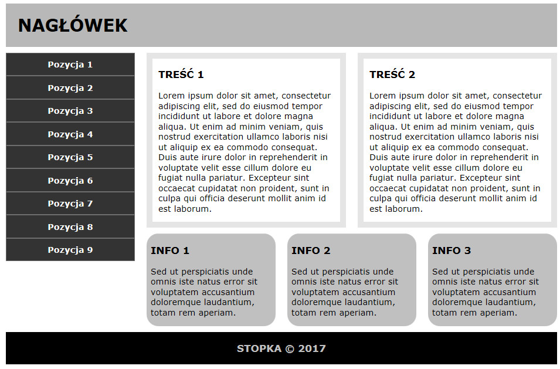
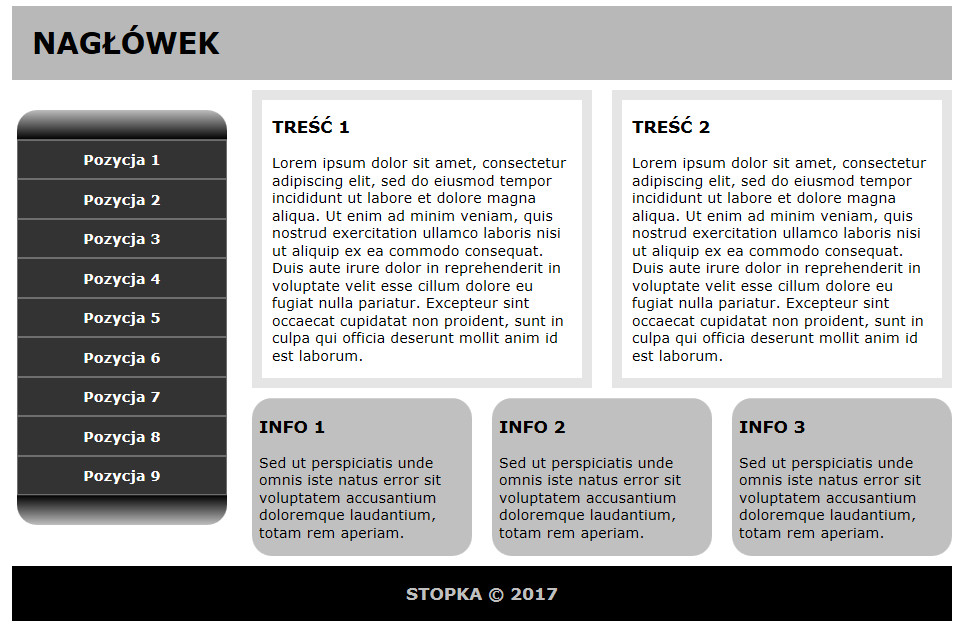
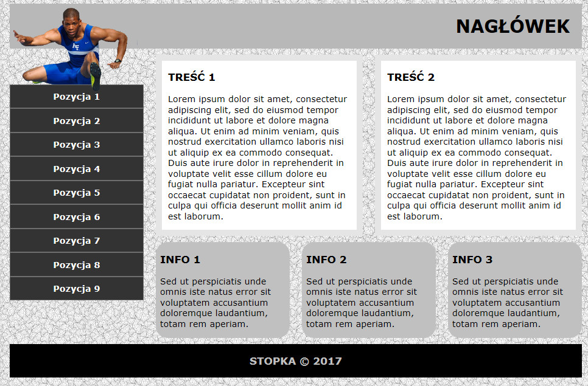
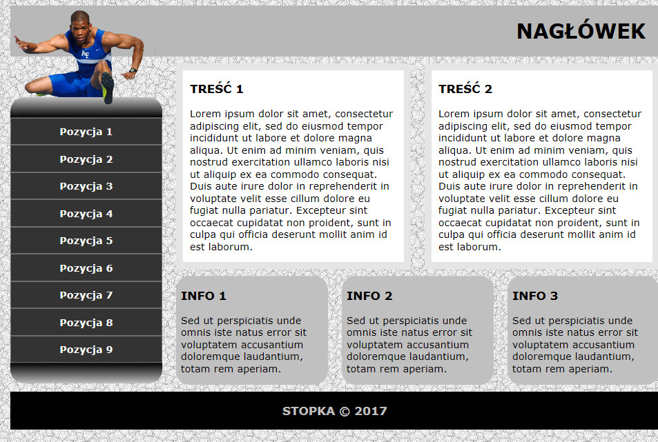

# KCK

## Projekt interfejsu użytkownika aplikacji rekrutacyjnej (HTML, CSS). ##

Grupy studentów przygotowują interfejs aplikacji internetowej przy pomocy *języka HTML* oraz *stylów kaskadowych CSS*. Zajęcia są realizowane w [Szkole Wyższej im. Pawła Włodkowica w Płocku](http://www.wlodkowic.pl) na przedmiocie Komunikacja człowiek-komputer. Zajęcia realizowane są metoda praktyczną, z wykorzystaniem najnowszych narzędzi, zgodnie z mottem, którego autorem jest znany pedagog Jahn Dewey:
>Jeśli uczymy uczniów tak samo dziś, jak uczyliśmy wczoraj, to pozbawiamy ich jutra.

Poszczególni członkowie pracują nad swoją gałęzią (branch), a kierownik scala je po przetestowaniu. W ten sposób studenci poznają technologie internetowe, a jednocześnie uczą się **pracować w zespole**. Harmonogram prac:
- założenie nowego projektu,
- przesłanie plików,
- założenie nowej gałęzi,
- przesłanie plików,
- porównaie rozwiązań,
- scalenie projektu do gałęzi głównej.

----------------------------------------------------------

## Wersja wyjściowa ##

## Wersja 1 ##

## Wersja 2 ##

## Wersja ostateczna ##

